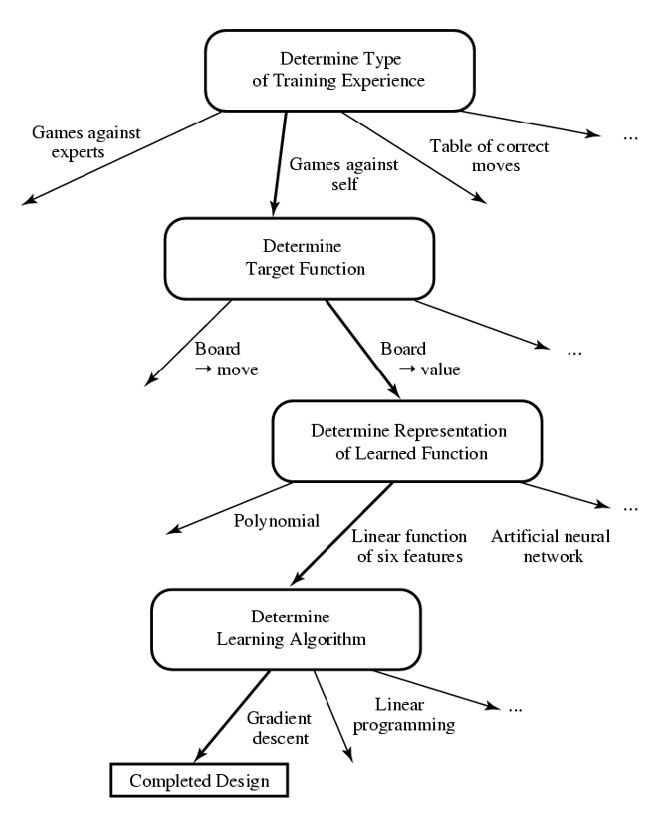

# Chapter 11: Machine Learning

### What is machine Learning
- Machine learning is a subfield of AI concerned with programs that learn from experience
- Learning: Improving with experience at some task
   - Improve over task **T**,
   - with respect to performance measure **P**,
   - based on experience **E**
   - Example: learn to play checkers
      - T: play checkers(and win)
      - P: % of games won against opponents
      - E: play opportunity against itself

### Main types of learning tasks
- Types of experience (Feedback)
   - Supervised: correct answers for each Example
      - classification (e.g. spoken words)
      - regression (e.g. share prices)
   - Unsupervised: correct answers not given
      - (e.g. clustering)
  - Reinforcement: occasional rewards

### Designing a learning System
- Target experience
- Target function
- Function representation
- Function approximation
- Final Design

### Some issues in ML
- What algorithms can approximate functions well and in what situations?
- how does the number of training examples influence accuracy?
- Memorization
