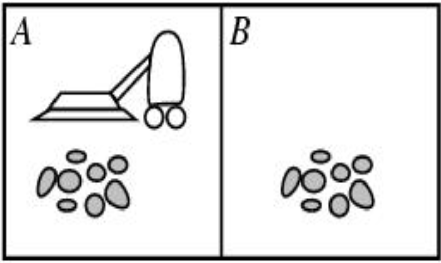
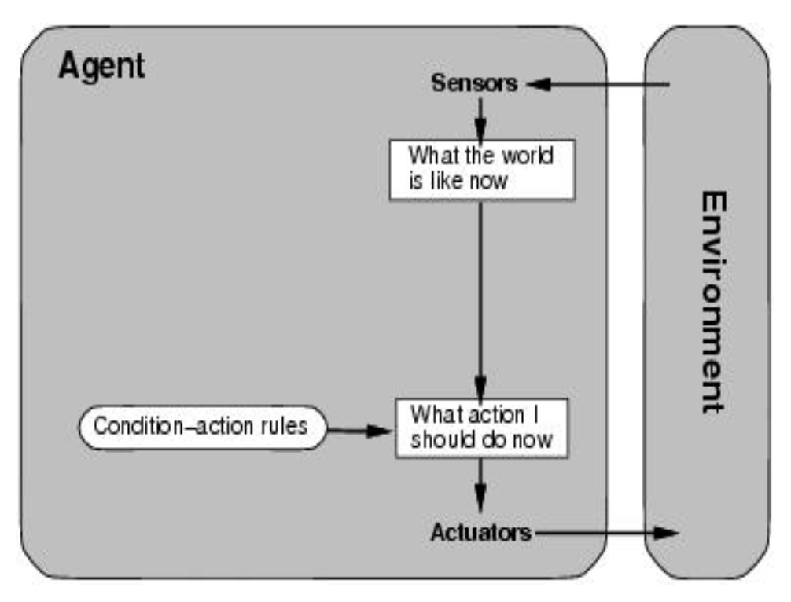

# Intelligent agents

## Agents

### Definitions
- __Agent:__ An agent is anything that can be viewed as perceiving its environment through sensors and acting upon that environment through actuators
- __Percept:__ Perceptual input (eg. text, image, sound, ... )
- __Rational Agent:__ For each possible percept sequence, a rational agent selects an action that maximizes performance measure, given evidence provided by the sequence, and built in knowledge in the agent
- __Performance Measure:__ Criterion for success
   - good vs bad
   - better vs worse
   - clear criterion vs less well defined
- __Rationality:__ reasonably correct
   - not perfection

### Environment types
##### Fully vs Partially
- Fully - everything seen shows all relevant information
- Partially - noise and inaccurate sensors, hidden/missing information

##### Deterministic vs Stochastic
- Deterministic - Next state completely depends on current state and next action by agent
- Stochastic - probabilistic; other factors involved (taxi driver cannot predict behavior of traffic)

##### Episodic vs Sequential
- episodic is self contained, independent situations
   - e.g. agent has to spot defective parts on an assembly. Looks solely at current part and not parts before
- Sequential - current decision affects future ones

##### Static vs Dynamic
- static - environment is fixed during decision making
- dynamic - environment changes while agent is deliberating

##### Discrete vs Continuous
- Discrete - finite number of states
- Continuous - smooth, infinite scale

##### Single agent vs Multi-agent
- single - one agent involved
- multi - more than one (adversarial or cooperative)

### Vacuum World Example

- Environment: Square A and B
- Percepts: [location and content]=>[A,Dirty]
- Actions: Left, right, suck, none

### The Concept of Rationality
- A **rational agent** is one that does the right thing.
   - every entry in the table is filled out correctly
- What is the right thing?
   - Approximation: the most successful agent.

### Rationality
- What is rational at a given time depends on four things:
   - performance measurements
   - prior environment knowledge
   - Actions
   - Percept sequence to date (sensors).

##### PEAS
- To design a rational agent we must specify its task envorinment
- description of environment
   - **P** erformance measurement
   - **E** nviroment
   - **A** ctuators
   - **S** ensors
###### Example
- Agent: Internet Shopping
   - Performance
      - Safety
      - Destination
      - Profits
      - Legality
      - Comfort
   - Environment
     - Streets
     - Other Cars
     - Pedestrians
   - Actuators
      - Steering
      - Accelerating
      - Brake
      - Horn
      - Display
   - Sensors
      - Video
      - Sonar
      - Speedometer
      - Engine Sensors
      - Keyboard
      - GPS

  Environment types

|              | Solitaire | Backgammon | Internet Shopping | taxi  |
| ------------ |:---------:|:----------:|:-----------------:|:-----:|
|Observable    |Full       | Full       |      Parital      |Partial|
|Deterministic |Yes        |No          |Yes                | No    |
|Episodic      |No         |No          |No                 |No|
|Static|Yes|Yes|Semi|No|
|Discrete|Yes|Yes|Yes|No|
|Single-Agent|Yes|No|No|No|

### Agent function and programs
- An agent is completely specified by the agent function mapping percept sequences to Actions
- Aim: find a way to implement the rational agent function concisely

#### Agent Structure
- How does the inside of the agent work?
   - Agent = architecture + program
- All agents have the same skeleton:
   - input = current Percepts
   - output = Action
   - Program = manipulates input to produce output

#### Agent types
##### Simple Reflex
- Select action on the basis of only the current percept
- large reduction in possible percept/action situations
- implemented through condition-action rules
- e.g if dirty then suck

