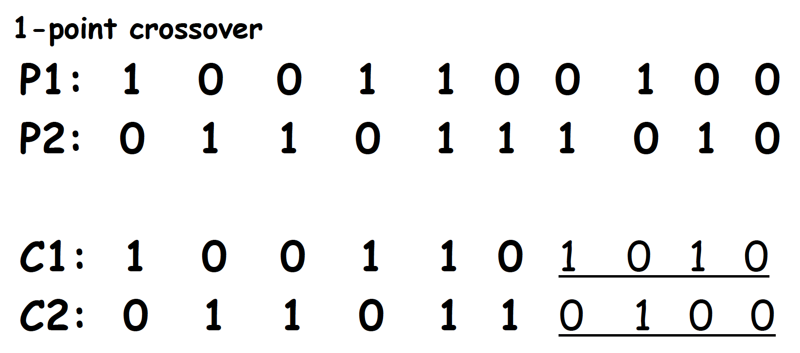
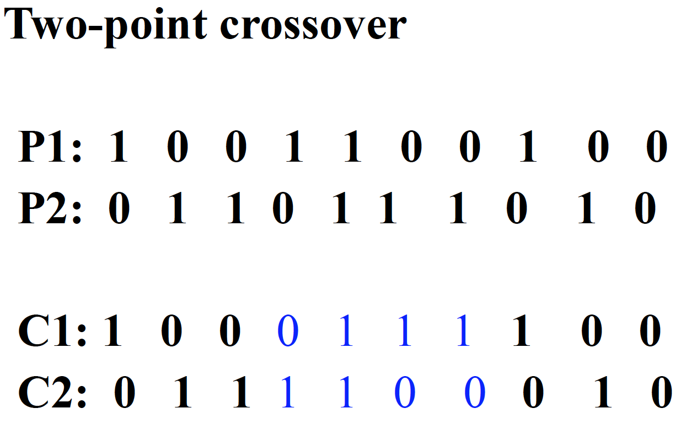
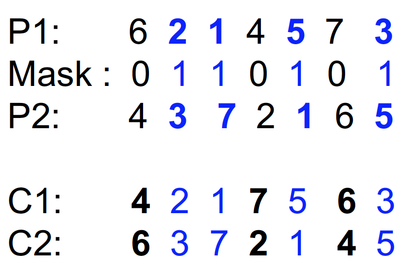

# Chapter 6: Genetic algorithms
### Crossovers

##### 1 Point(n-point) Crossovers
- 1-point:

   
- 2-point:

   

##### Uniform-order Crossovers

### Difference between GA and GP

The Largest difference between Genetic algorithms and genetic programs is what is being mutated. In a Genetic algorithm each solution is being mutated to explore whereas in genetic program a part of the program will be mutated and crossed over to produce a new result. The solution for a genetic algorithms is represented as a solution while the genetic program is written as a tree. To mutate this tree you can select a leaf and replace it with a random subtree or leaf
